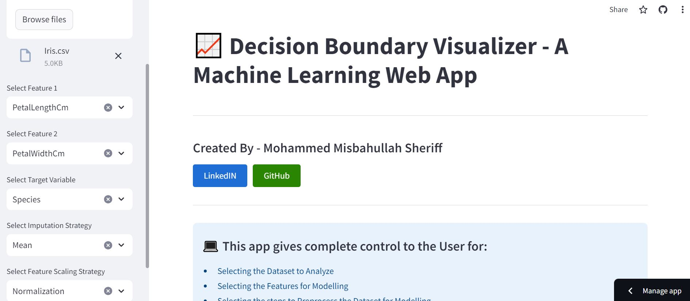
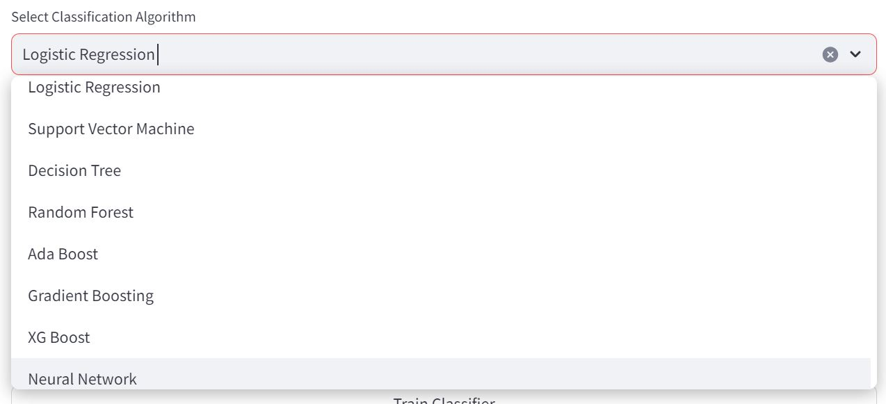
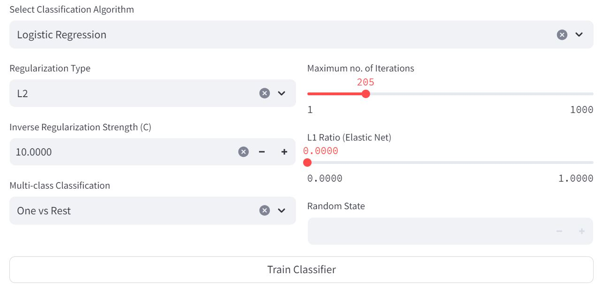
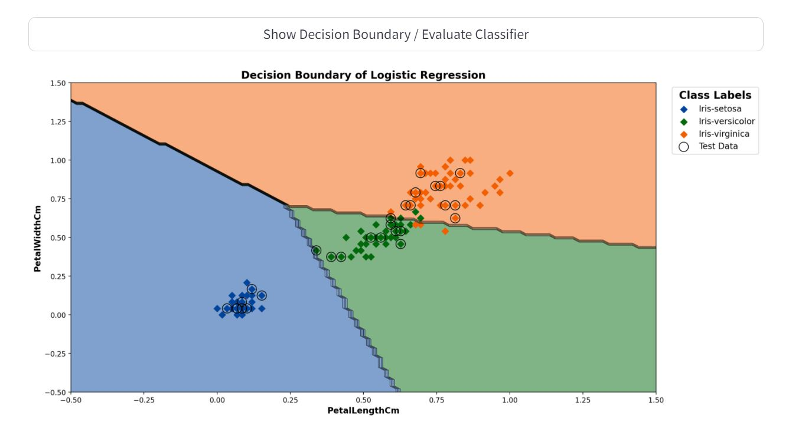
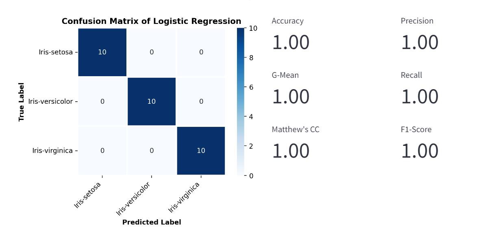

# Decision Boundary Visualizer - ML Web App

## Table of Contents:

- [Project Overview](#project-overview)
- [Web Application](#web-application)
- [Tools Used](#tools-used)
- [Project Workflow](#project-workflow)
- [Note](#note)
- [Let's Connect](#lets-connect)

## Project Overview:
- The primary objective of this app is to enable users to visualize decision boundaries of classification algorithms on any given dataset.
- It empowers users with complete control over various aspects of data preprocessing, model selection, model training and visualization.
- This app will help users dive beyond the black-box nature of most ML algorithms and help understand and visually interpret how a particular learning algorithm discriminates between data points for the provided hyperparameter configuration.
- It can also help users understand the effect of various hyperparameters of a learning algorithm and how much it contributes to the model's decision-making process.

## Web Application:

- [Web Application Link](https://ml-decision-boundary-visualizer.streamlit.app/)
- Screenshots:

    

 

    
    

 

    
    

## Tools Used:

- Git
- Anaconda
- Python
- Jupyter
- VSCode
- Pandas
- Numpy
- Scikit-learn
- Imbalanced-learn
- XGBoost
- Matplotlib
- Seaborn
- Streamlit

## Project Workflow:
- Used:
  - VS Code IDE for project development
  - Git for version control, tracking changes and pushing code to GitHub
  - Streamlit for app development
- Implemented appropriate widgets provided by Streamlit for gathering input from the user to dictate the behaviour of the web-app
- Designed the app to include a sidebar, which will collect necessary information about the dataset and preprocessing
- Provided complete control to the user to:
  - Upload any dataset of choice (appropriate for classification)
  - Select any two input numeric features
  - The target variable to use
- Implemented a drop-down list to enable users to determiine how to preprocess the data
- For handling missing values, users can select any of below strategies:
  - Mean imputation
  - Median imputation
  - Most-frequent value imputation
  - Constant value imputation
- Users have option to scale the features using following strategies:
  - Standardization
  - Normalization
  - No scaling
- The users can now select any of the following learning algorithms for classification:
  - Naive Bayes
  - Logistic Regression
  - Support Vector Machine
  - Decision Tree
  - Random Forest
  - Ada Boost
  - Gradient Boosting
  - XG Boost
  - Neural Network
- For each algorithm, users can select any configuration of relevant hyperparameters and train the model with the click of a button
- Users can now select a marker and colors to use for aesthetics of the decision boundary plot
  - The app will determine the necessary no. of colors required based on the cardinality of the specified target variable
- With the click of a button, the app will display the resulting decision boundary with the given user inputs
- Also, the app will report the performance of the trained model on the test data using the following metrics:
  - Accuracy
  - Geometric Mean
  - Matthew's Correlation Coefficient
  - Precision
  - Recall
  - F1 Score
- Implemented necessary checks to handle any possible errors with regards to user input so that:
  - The app can function smoothly without breaking; and
  - The users are provided a seamless and friendly experience while utilizing the app

## Note:

- Thank you for going through my work 😀
- Hope you found it useful! 💫
- If you have some suggestions to improve this repository/project, please feel free to let me know 👍
- I'm always open to learning what I could've done better! 🚀

## Let's Connect:

- [LinkedIN](https://www.linkedin.com/in/mohammed-misbahullah-sheriff/)
